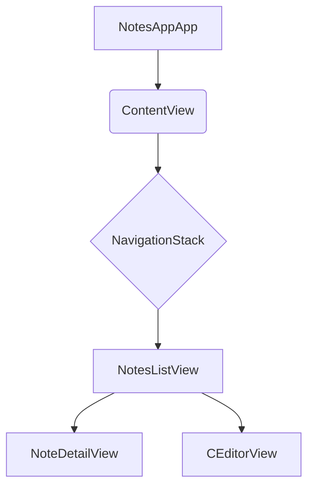

# Run-C iOS Application Documentation

This document provides a detailed explanation of the Run-C iOS application's architecture, key components, and their interactions.

**Note on Diagrams:** This document includes diagrams generated using [Mermaid syntax](https://mermaid-js.github.io/). To view these diagrams rendered correctly, please use a Markdown viewer that supports Mermaid (e.g., GitHub, GitLab, VS Code with a Mermaid extension, or various online Markdown editors).

## Table of Contents
1.  [Overall Application Flow](#overall-application-flow)
2.  [Core Data Model](#core-data-model)
3.  [View Hierarchy and Navigation](#view-hierarchy-and-navigation)
    *   [NotesAppApp.swift](#notesappappswift)
    *   [ContentView.swift](#contentviewswift)
    *   [NotesListView.swift](#noteslistviewswift)
    *   [NoteDetailView.swift](#notedetailviewswift)
    *   [CEditorView.swift](#ceditorviewswift)
4.  [Persistence Layer](#persistence-layer)
    *   [PersistenceController.swift](#persistencecontrollerswift)
5.  [C Code Execution](#c-code-execution)
    *   [CRunner.swift](#crunnerswift)
    *   [CSyntaxHighlighter (within CEditorView.swift)](#csyntaxhighlighter-within-ceditorviewswift)
6.  [Theming](#theming)

---

## 1. Overall Application Flow

The application starts with `NotesAppApp.swift`, which sets up the main window and the Core Data environment. `ContentView.swift` then acts as the root view, embedding a `NavigationStack` that leads to `NotesListView`. From `NotesListView`, users can navigate to `NoteDetailView` to create or edit notes, or to `CEditorView` for the C code sandbox.

The following diagram illustrates the overall application flow:



---

## 2. Core Data Model

The application uses Core Data for persistent storage of notes. The data model is defined in `NotesModel.xcdatamodeld` and typically includes an entity for `Note` with attributes such as:

*   `title`: String (e.g., "My First Note")
*   `content`: String (e.g., "This is the content of my note.")
*   `createdDate`: Date (e.g., when the note was first created)
*   `modifiedDate`: Date (e.g., when the note was last updated)

---

## 3. View Hierarchy and Navigation

### NotesAppApp.swift

This is the entry point of the SwiftUI application. It sets up the `PersistenceController` and injects the `managedObjectContext` into the environment, making it available to all child views for Core Data operations.

```swift
@main
struct NotesAppApp: App {
    let persistenceController = PersistenceController.shared

    var body: some View {
        WindowGroup {
            ContentView()
                .environment(\.managedObjectContext, persistenceController.container.viewContext)
        }
    }
}
```

### ContentView.swift

`ContentView` serves as the root view for the application's main content. It embeds `NotesListView` within a `NavigationStack`, enabling hierarchical navigation between different views.

```swift
struct ContentView: View {
    var body: some View {
        NavigationStack {
            NotesListView()
        }
    }
}
```

### NotesListView.swift

This view displays a list of all saved notes. Users can tap on a note to view/edit its details (`NoteDetailView`), add new notes, or access the C Editor (`CEditorView`). It also supports deleting notes.

**Key Features:**
*   Fetches notes using `@FetchRequest` from Core Data.
*   Uses `NavigationLink` for navigation to `NoteDetailView` and `CEditorView`.
*   Provides `ToolbarItem` buttons for adding new notes and accessing the C Editor.
*   Implements `onDelete` functionality for removing notes from the list.
*   Applies a blue and white theme to the navigation bar and list elements.

### NoteDetailView.swift

This view allows users to view, create, or edit a single note. It contains `TextField` for the note title and `TextEditor` for the note content.

**Key Features:**
*   Initializes with an optional `Note` object; if `nil`, it's a new note.
*   Uses `@State` variables to bind to the `TextField` and `TextEditor`.
*   Provides "Cancel" and "Save" buttons in the toolbar.
*   `saveNote()` function handles saving new notes or updating existing ones in Core Data.
*   Applies a blue and white theme to the navigation bar and input fields.

### CEditorView.swift

This view provides an offline C code sandbox. Users can write C code, run it, and see the output in a console. It includes basic syntax highlighting and error detection.

**Key Features:**
*   Integrates `CodeEditorView` (a `UIViewRepresentable`) for the text editing area.
*   Displays console output, warnings, and error messages.
*   Provides "Reset" and "Run" buttons in the toolbar.
*   `runCode()` function executes the C code using `OfflineCCompiler` (from `CRunner.swift`).
*   Applies a blue and white theme to the navigation bar, editor, and console elements.

---

## 4. Persistence Layer

### PersistenceController.swift

This class manages the Core Data stack for the application. It is responsible for setting up the `NSPersistentContainer` and providing the `managedObjectContext` to the SwiftUI environment.

**Key Features:**
*   `shared` static instance for singleton access.
*   `container`: `NSPersistentContainer` instance.
*   Initializes the Core Data stack and handles potential errors during loading.
*   Provides a `preview` static instance for use in SwiftUI previews.

---

## 5. C Code Execution

### CRunner.swift

This file (or a class within it, like `OfflineCCompiler`) is responsible for compiling and executing C code offline within the app. It likely uses a sandboxed environment or a pre-compiled C interpreter.

**Key Features:**
*   `OfflineCCompiler` class (or similar) to encapsulate the compilation and execution logic.
*   `run(source: String)` method to take C code as input and return execution results (output, warnings, duration, errors).

### CSyntaxHighlighter (within CEditorView.swift)

This struct provides basic syntax highlighting for the C code editor. It identifies keywords, comments, and strings, applying different colors to them. It also includes a heuristic for marking suspicious lines (e.g., missing semicolons).

**Key Features:**
*   `keywords`, `commentPattern`, `stringPattern` for regex matching.
*   `highlight(text: String)` method to return an `NSAttributedString` with syntax highlighting.
*   `applyHighlighting` and `markSuspiciousLines` helper methods.

---

## 6. Theming

The application utilizes a blue and white theme across its main views. This is achieved by:

*   **Accent Color:** Setting `.tint(.blue)` on `NavigationLink` and `Button` elements.
*   **Navigation Bar Appearance:** Customizing `UINavigationBarAppearance` in `onAppear` blocks within views to set a `systemBlue` background and `white` title text.
*   **Backgrounds:** Setting `Color.white` for various view backgrounds, text fields, and console areas.
*   **Syntax Highlighting:** Adjusting `UIColor` values within `CSyntaxHighlighter` to complement the blue and white palette while maintaining readability for code elements.
